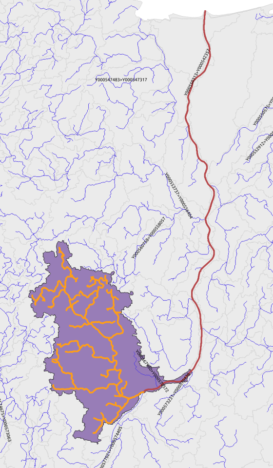
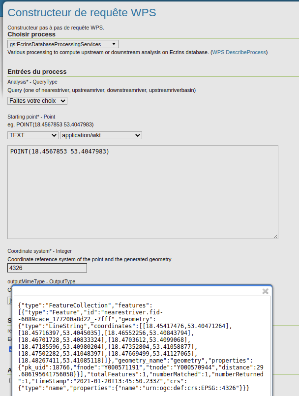
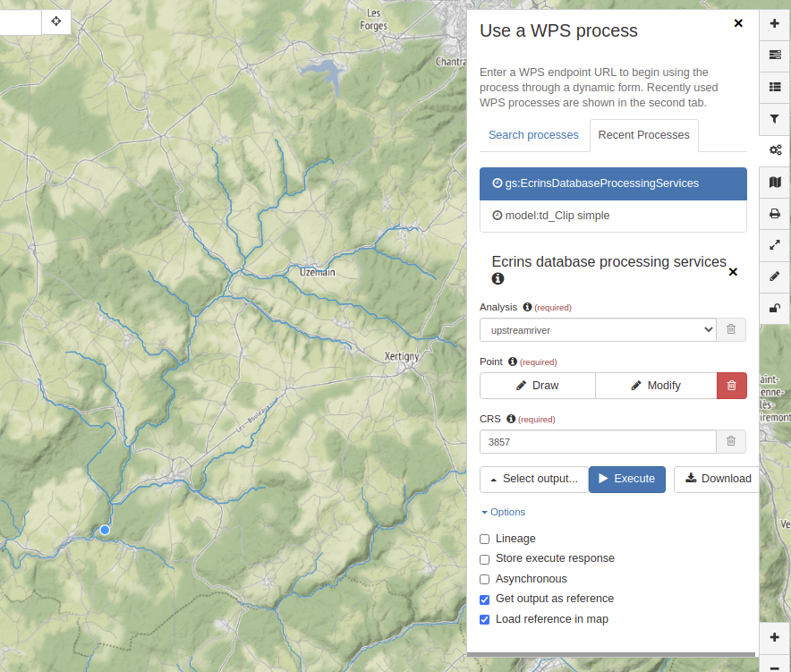

# Processing Ecrins

Providing various upstream and downstream analysis using Ecrins database.





Input dataset:
* https://sdi.eea.europa.eu/catalogue/srv/eng/catalog.search#/search?any=ecrins&facet.q=status%2Fnotobsolete
* Projection: EPSG:3035

## Processes

### Nearest river

```sql
-- Nearest river from point
-- https://postgis.net/workshops/postgis-intro/knn.html
-- WITH coordinate AS (SELECT 4882021 as lon, 3399080 as lat, 3035 as srs)
WITH coordinate AS (SELECT 18.4567853 as lon, 53.4047983 as lat, 4326 as srs)
SELECT
    pk_uid, fnode, tnode, geometry,
    ST_Distance(
            geometry,
            ST_Transform(concat('SRID=', c.srs,';POINT(', c.lon, ' ', c.lat, ')')::geometry, 3035)
        ) AS distance
FROM
    c_tr r, coordinate c
ORDER BY
        geometry <->
        ST_Transform(concat('SRID=', c.srs,';POINT(', c.lon, ' ', c.lat, ')')::geometry, 3035)
LIMIT 1;
```

GeoServer view:

```sql
WITH coordinate AS (SELECT %lon% as lon, %lat% as lat, %srs% as srs)
SELECT
    pk_uid, fnode, tnode, geometry,
    ST_Distance(
            geometry,
            ST_Transform(concat('SRID=', c.srs,';POINT(', c.lon, ' ', c.lat, ')')::geometry, 3035)
        ) AS distance
FROM
    c_tr r, coordinate c
ORDER BY
        geometry <->
        ST_Transform(concat('SRID=', c.srs,';POINT(', c.lon, ' ', c.lat, ')')::geometry, 3035)
LIMIT 1
```


eg.
http://localhost:8080/geoserver/ecrins/ows?service=WFS&version=1.0.0&request=GetFeature&typeName=ecrins%3Anearestriver&viewparams=lon:4882021;lat:3399080
http://localhost:8080/geoserver/ecrins/ows?service=WFS&version=1.0.0&request=GetFeature&typeName=ecrins%3Anearestriver&viewparams=lon:4882021;lat:3397080

### Upstream river

Use recursive query to navigate segments graph upstream from fnode to tnode.

* First test: 28s (114 segments)

```sql
CREATE INDEX c_tr_fnode ON c_tr(fnode);
CREATE INDEX c_tr_tnode ON c_tr(tnode);
```

* Second test: 28ms (114 segments)

Query:

```sql
DROP TABLE upstreamriver;
CREATE TABLE upstreamriver AS (
    SELECT ST_union(geometry) AS river
    FROM (
             WITH RECURSIVE rivers AS (
                 SELECT pk_uid,
                        fnode,
                        tnode,
                        geometry
                 FROM c_tr
                 WHERE pk_uid = 18766
                 UNION
                 SELECT e.pk_uid,
                        e.fnode,
                        e.tnode,
                        e.geometry
                 FROM c_tr e
                          INNER JOIN rivers s ON s.fnode = e.tnode
             )
             SELECT *
             FROM rivers
         ) AS upstream
);
```

GeoServer view

```sql
WITH coordinate AS (SELECT %lon% as lon, %lat% as lat, %srs% as srs)
SELECT ST_union(geometry) AS river
    FROM (
             WITH RECURSIVE rivers AS (
                 SELECT pk_uid,
                        fnode,
                        tnode,
                        geometry
                 FROM c_tr
                 WHERE pk_uid = (SELECT
                                     pk_uid
                                 FROM
                                     c_tr r, coordinate c
                                 ORDER BY
                                         geometry <->
                                         ST_Transform(concat('SRID=', c.srs,';POINT(', c.lon, ' ', c.lat, ')')::geometry, 3035)
                                 LIMIT 1)
                 UNION
                 SELECT e.pk_uid,
                        e.fnode,
                        e.tnode,
                        e.geometry
                 FROM c_tr e
                          INNER JOIN rivers s ON s.fnode = e.tnode
             )
             SELECT *
             FROM rivers
         ) AS upstream
```

### Downstream river

```sql
DROP TABLE downstreamriver;
CREATE TABLE downstreamriver AS (
    SELECT ST_union(geometry) AS river
    FROM (
             WITH RECURSIVE rivers AS (
                 SELECT pk_uid,
                        fnode,
                        tnode,
                        geometry
                 FROM c_tr
                 WHERE pk_uid = 18766
                 UNION
                 SELECT e.pk_uid,
                        e.fnode,
                        e.tnode,
                        e.geometry
                 FROM c_tr e
                          INNER JOIN rivers s ON s.tnode = e.fnode
             )
             SELECT *
             FROM rivers
         ) AS downstream
);
```

GeoServer view:

```sql
WITH coordinate AS (SELECT %lon% as lon, %lat% as lat, %srs% as srs)
SELECT ST_union(geometry) AS river
    FROM (
             WITH RECURSIVE rivers AS (
                 SELECT pk_uid,
                        fnode,
                        tnode,
                        geometry
                 FROM c_tr
                 WHERE pk_uid = (SELECT
                             pk_uid
                         FROM
                             c_tr r, coordinate c
                         ORDER BY
                                 geometry <->
                                 ST_Transform(concat('SRID=', c.srs,';POINT(', c.lon, ' ', c.lat, ')')::geometry, 3035)
                         LIMIT 1)
                 UNION
                 SELECT e.pk_uid,
                        e.fnode,
                        e.tnode,
                        e.geometry
                 FROM c_tr e
                          INNER JOIN rivers s ON s.tnode = e.fnode
             )
             SELECT *
             FROM rivers
         ) AS downstream
```


### Upstream river basin


```sql
DROP TABLE upstreamriverbasin;
CREATE TABLE upstreamriverbasin AS (
    SELECT ST_union(b.geometry) AS basin
    FROM c_zhyd b, (
             WITH RECURSIVE rivers AS (
                 SELECT pk_uid,
                        fnode,
                        tnode,
                        geometry
                 FROM c_tr
                 WHERE pk_uid = 18766
                 UNION
                 SELECT e.pk_uid,
                        e.fnode,
                        e.tnode,
                        e.geometry
                 FROM c_tr e
                          INNER JOIN rivers s ON s.fnode = e.tnode
             )
             SELECT *
             FROM rivers
         ) AS upstream 
    WHERE ST_Intersects(b.geometry, upstream.geometry)
);
```


GeoServer view:

```sql
WITH coordinate AS (SELECT %lon% as lon, %lat% as lat, %srs% as srs)
SELECT ST_union(b.geometry) AS basin
    FROM c_zhyd b, (
             WITH RECURSIVE rivers AS (
                 SELECT pk_uid,
                        fnode,
                        tnode,
                        geometry
                 FROM c_tr
                 WHERE pk_uid = (SELECT
                                     pk_uid
                                 FROM
                                     c_tr r, coordinate c
                                 ORDER BY
                                         geometry <->
                                         ST_Transform(concat('SRID=', c.srs,';POINT(', c.lon, ' ', c.lat, ')')::geometry, 3035)
                                 LIMIT 1)
                 UNION
                 SELECT e.pk_uid,
                        e.fnode,
                        e.tnode,
                        e.geometry
                 FROM c_tr e
                          INNER JOIN rivers s ON s.fnode = e.tnode
             )
             SELECT *
             FROM rivers
         ) AS upstream 
    WHERE ST_Intersects(b.geometry, upstream.geometry)
```


## Demo request


Process description: http://localhost:8081/geoserver/ows?service=WPS&version=1.0.0&request=DescribeProcess&identifier=gs:EcrinsDatabaseProcessingServices







Sample point geometry:

```
POINT(4882021 3399080)
POINT(18.4567853 53.4047983)
```

Direct WFS query:
* http://localhost:8081/geoserver/ecrins/ows?service=WFS&version=2.0.0&request=GetFeature&srsName=EPSG:3035&typeName=ecrins%3Anearestriver&viewparams=lon:4882021.0;lat:3399080.0;crs:3035&outputFormat=json
* http://localhost:8081/geoserver/ecrins/ows?service=WFS&version=2.0.0&request=GetFeature&srsName=EPSG:3035&typeName=ecrins%3Anearestriver&viewparams=lon:18.4567853;lat:53.4047983;crs:4326&outputFormat=json


## GeoServer install


```shell script
mvn clean install; cp target/gs-wps-ecrins-2.8-SNAPSHOT.jar /data/apps/gsecrins/webapps/geoserver/WEB-INF/lib/.
```


## Importing in data repository

Create database:

```sql
psql -U www-data -W -h localhost postgres

CREATE DATABASE ecrins;
\c ecrins
CREATE EXTENSION postgis;
```


Use OGR to load the data:

```shell script
cd /data/project/2021/oieau/ecrins/
ogr2ogr -f PostgreSQL PG:"host=localhost port=5432 user=www-data dbname=ecrins password=www-data" -a_srs "EPSG:4326" EcrRiv.sqlite

ogr2ogr -f PostgreSQL PG:"host=localhost port=5432 user=www-data dbname=ecrins password=www-data" EcrFEC.sqlite
```
